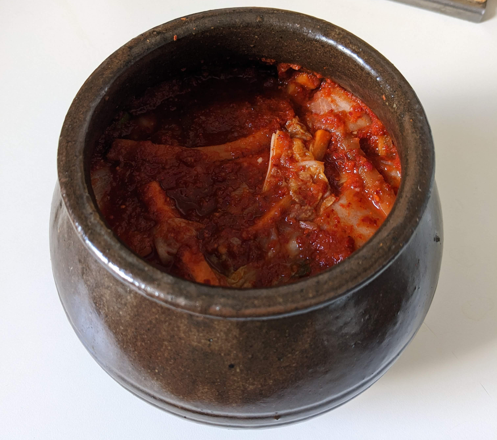

# Kimchi Recipe

## Intro

Kimchi is quite simple to make but it is quite time consuming, so maybe do it when you have a free afternoon. You can play around with the ingredients and amounts, and feel free to use it as a way to extend the life of veg you have in the fridge. **However, make sure you get the right amount of salt. The percentage of salt is the most important factor in getting your kimchi to ferment properly.** My recipe is based on this one from [Mangchi](https://www.youtube.com/watch?v=nLdvLt8XQ3Y), so full credit to her, she's awesome, go checkout her channel if you haven't already. I have made a number of changes, most importantly including more exact methods for getting the salt percentage correct and replacing the vegan broth with a Japanese equivalent that I think is easier to make.

**Note on fermenting:** If this is your first time fermenting, great! Don't worry! Fermenting is generally much simpler than it has a reputation for being and kimchi is a great place to start. Kimchi is made with lacto-fermentation which utilizes bacteria naturally present on vegetables, skin and surfaces. I don't find you need to use sterilized equipment, gloves (except for keeping chilli off your hands) or anything like that.

## Equipment

* About 2L jar(s), ceramic pot or [Onggi](https://en.wikipedia.org/wiki/Onggi)
* Large metal or ceramic bowls for mixing

## Ingredients 

**Note:** This kimchi comes out very strong tasting, so feel free to reduce the amount of gochugaru, garlic and ginger if you want a milder kimchi

* Plenty of sea salt or Kosher salt
* 1 nappa/Chinese cabbage 
* 10g dashima/Kombu (kelp for the stock)
* 15g dried shiitake mushrooms (for the stock)
* 4-8 carrots
* 4 spring onions
* 1 bulb of garlic
* 2 inch of ginger (I think this helps kick start the fermentation)
* 1 Apple or pear
* 50-100g of gochugaru depending on how spicy you want it (you can blend dried chilli's but it is a real pain, trust me I have tried)
* 2 tbsp of kimchi juice from a past batch or good brand (optional)

## Instructions

1. Cut your cabbage leaves into 2 inch pieces, don't worry too much about washing it now, we will do that later. Put a bowl on a scale and tare it. Put your cut cabbage in it with 100ml of water, add 4% of the total weight in salt and give it a good mix. Cover the bowl and leave it for around 4 hours, mixing it every hour or so.
2. Meanwhile start the broth. Add your dried mushrooms and kombu to a pot with 500ml of cold water. Put it over a medium heat and turn it off just before the water comes to a boil. Leave the pot covered for at least 2 hours to stew.
3. Cut the carrots into 1cm thick sticks, and the spring onions into 3 inch sticks. Weigh the combination and note it down.
4. When the stock is done, take out the kombu and mushrooms (you can keep the mushrooms and use them to make [soy pickled shiitake](https://cleanplates.com/recipe/pickled-shiitake-mushroom-recipe/)). Peal the garlic and ginger and roughly chop your apple/pear. Blend the garlic, ginger, apple/pear with the stock. Mix in the gochugaru and note the total weight. 
5. Calculate the amount of salt you need. This is 2% of the total weight of the veg and the sauce. Mix the salt into the sauce with the kimchi juice if you have it.
6. When the cabbage is done, drain it and wash it thoroughly 4-5 times, gently squeezing the brine out of the cabbage as you do. The cabbage should taste well seasoned but not too salty when tasted.
7. Mix together the veg, the cabbage and the sauce. If you use your hands for the mixing, I would recommend using gloves, or if not, wash your hands very well before going to the loo.
8. Put the kimchi into your jars or containers and press it down to remove any air bubbles in the mixture. Lacto-fermentation works without oxygen where as bad fermentation needs it, so getting rid of the air helps protect your ferment. For this reason, having a layer of sauce on top of the jar is also a good precaution.
9. Leave to ferment at room temperature for 2-4 days depending on how warm it is. If your container is sealed, crack it open every day or two to release the pressured gas. 
10. Move the kimchi to the fridge or outdoors if it is cold. The kimchi will be ready to eat, but will become less garlicy and more sour the longer you leave it. I personally find kimchi is at its best 2-3 weeks old, and even older kimchi tends to be better for cooking. You can keep kimchi pretty much [indefinitely in the fridge](https://www.youtube.com/watch?v=Q2-UqR-cqnU). 

**Note on mould:** If your kimchi develops white mould on top, this is likely [kahm yeast](https://melissaknorris.com/kahm-yeast/) and fine to just scope off. If the mould is green or black, something has gone wrong and you should chuck it.
